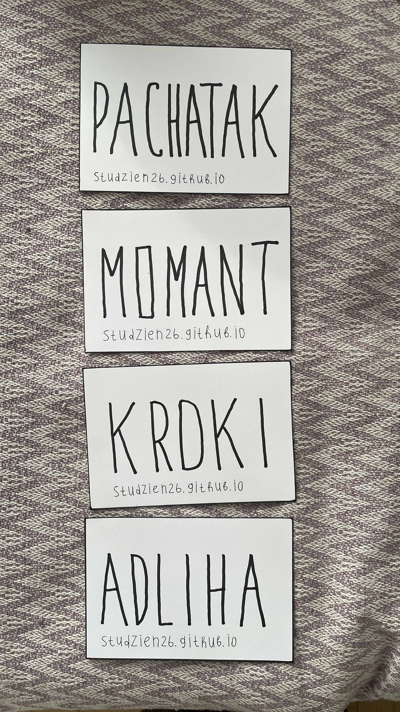
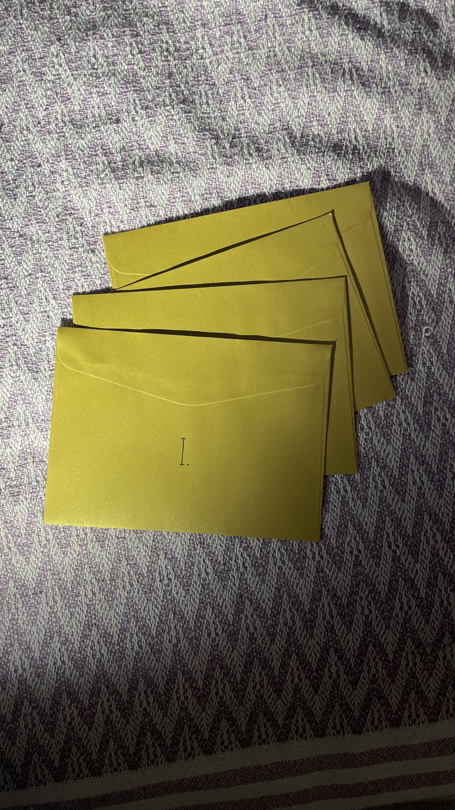

Лічбавая гісторыя нашага сумеснага студзеня 2026 года ў Тбілісі.

Чатыры пазалочаных канверты, у якіх былі кады. Раз на тыдзень трэба было адкрываць адзін канверт і ўводзіць код на сайце https://studzien26.github.io/ 

### Коды з канвертаў

* Першы тыдзень: pachatak
* Другі тыдзень: momant
* Трэці тыдзень: kroki
* Чацьвёрты тыдзень: adliha

Фоты для гісторыі, калі раптам канверты згубяцца:

  
  

